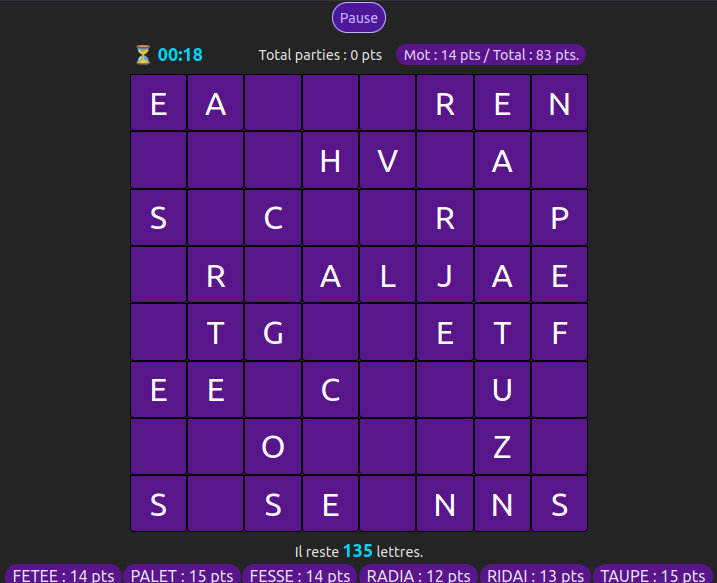

# TURBOSPELL

Jeu de lettres développé avec React 19 + Vite et TailwindCSS 4. 

Le jeu consiste à former des mots du dictionnaire ou verbes conjugués dans une grille, en moins d'une minute, jusqu'à épuisement de la totalité des lettres.
 
La grille contient 64 cases (8x8). Le nombre de colonnes est défini en variable globale **COLS_NB** dans le composant **<Board/>**. 


## Démo en ligne
👉 [Tester Turbospell : ](https://sylvieswebcorner.fr/games/turbospell)




## 🔧 Installation

### ✅ Pré-requis

- Node.js >= 22.x
- npm ou pnpm

Cloner le repo, installer les dépendances et lancer le serveur de développement :

```bash
git clone https://github.com/Sylvie-C/turbospell 
cd turbospell
npm install
npm run dev
``` 


### 4. 🕹 Fonctionnalités

```md
## ✨ Fonctionnalités

- 🎮 Jeu de rapidité en orthographe
- ⌛ Chronomètre intégré
- ✅ Validation instantanée des mots
- 📊 Calcul de score
- 🖼 Interface responsive
```


## 🛠️ Technologies

- React 19
- Vite
- TailwindCSS 4
- Zustand (Global State management)


## 📄 Licence
MIT — libre d’utiliser, de modifier, de partager

